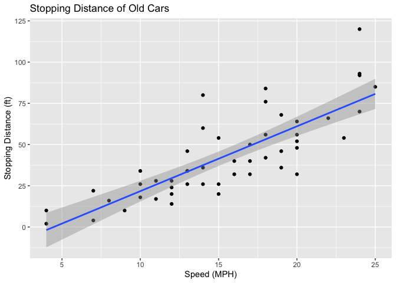
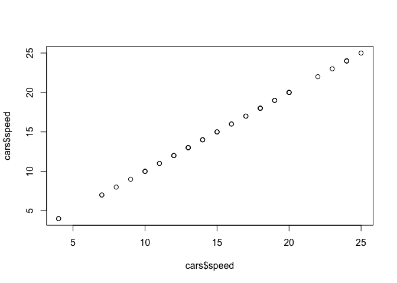
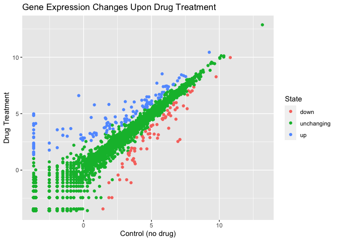
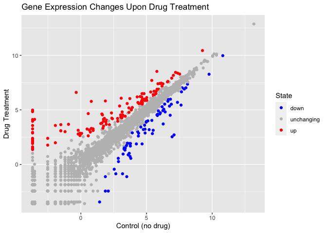
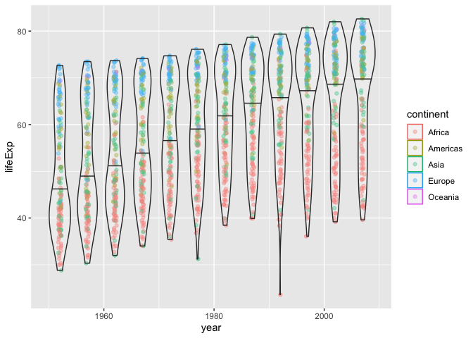

Data Visualization
================
Shivani
2021-12-03

``` r
# Class 05: Data Visualization

# learning to use ggplot2

# load package
library(ggplot2)

# cars dataset is built in

# beginning of the dataset
head(cars)
```

    ##   speed dist
    ## 1     4    2
    ## 2     4   10
    ## 3     7    4
    ## 4     7   22
    ## 5     8   16
    ## 6     9   10

``` r
# ggplot has: data + aes + geoms
ggplot(data = cars) +
  aes(x = speed, y = dist) +
  geom_point() +
  geom_smooth(method = "lm") +
  labs(title = "Stopping Distance of Old Cars",
       x = "Speed (MPH)",
       y = "Stopping Distance (ft)")
```

    ## `geom_smooth()` using formula 'y ~ x'

<!-- -->

``` r
# can use other packages to make figures such as 'base' R
plot(cars$speed, cars$speed)
```

<!-- -->

``` r
# importing RNA-seq data
url <- "https://bioboot.github.io/bimm143_S20/class-material/up_down_expression.txt"
genes <- read.delim(url)
head(genes)
```

    ##         Gene Condition1 Condition2      State
    ## 1      A4GNT -3.6808610 -3.4401355 unchanging
    ## 2       AAAS  4.5479580  4.3864126 unchanging
    ## 3      AASDH  3.7190695  3.4787276 unchanging
    ## 4       AATF  5.0784720  5.0151916 unchanging
    ## 5       AATK  0.4711421  0.5598642 unchanging
    ## 6 AB015752.4 -3.6808610 -3.5921390 unchanging

``` r
# info about data
nrow(genes)
```

    ## [1] 5196

``` r
colnames(genes)
```

    ## [1] "Gene"       "Condition1" "Condition2" "State"

``` r
ncol(genes)
```

    ## [1] 4

``` r
# quantity of each value in State column
table(genes$State)
```

    ## 
    ##       down unchanging         up 
    ##         72       4997        127

``` r
# percentage of genes that are downregulated, unchanging, or upregulated
round(table(genes$State) / nrow(genes) * 100, 2)
```

    ## 
    ##       down unchanging         up 
    ##       1.39      96.17       2.44

``` r
# plotting genes data as scatterplot, color coded by State variable, and labeled
p <- ggplot(genes) + 
  aes(x = Condition1, y = Condition2, col = State) + 
  geom_point() + 
  labs(title = 'Gene Expression Changes Upon Drug Treatment',
       x = 'Control (no drug)', 
       y = 'Drug Treatment')
p
```

<!-- -->

``` r
# changing colors to red, gray, blue
p + scale_colour_manual(values = c("blue", "gray", "red"))
```

<!-- -->

``` r
# gapminder data
library(gapminder)
head(gapminder)
```

    ## # A tibble: 6 x 6
    ##   country     continent  year lifeExp      pop gdpPercap
    ##   <fct>       <fct>     <int>   <dbl>    <int>     <dbl>
    ## 1 Afghanistan Asia       1952    28.8  8425333      779.
    ## 2 Afghanistan Asia       1957    30.3  9240934      821.
    ## 3 Afghanistan Asia       1962    32.0 10267083      853.
    ## 4 Afghanistan Asia       1967    34.0 11537966      836.
    ## 5 Afghanistan Asia       1972    36.1 13079460      740.
    ## 6 Afghanistan Asia       1977    38.4 14880372      786.

``` r
#plotting life expectancy by year
ggplot(gapminder) +
  aes(x = year, y = lifeExp, col = continent) + 
  geom_jitter(width = 0.3, alpha = 0.4) + 
  geom_violin(aes(group = year), alpha = 0.2, draw_quantiles = 0.5)
```

<!-- -->

``` r
# makes interactive plot
# library(plotly)
# ggplotly()
```
