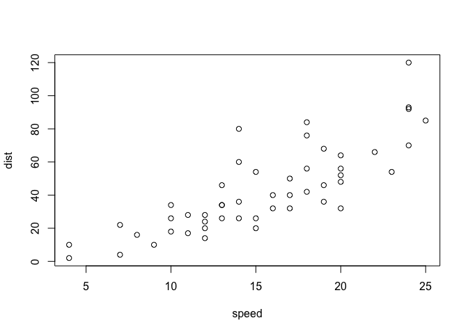

Class 6: R Functions
================
Shivani Khosla (PID: A59010433)
10/15/2021

## Quick Rmarkdown intro

We can write text of course just like any file. We can **style text to
be bold** or *italic*.

Do:

-   this
-   and that
-   and another thing

This is more text  
and this is a new line

------------------------------------------------------------------------

We can include some code:

``` r
plot(1:10)
```

<!-- -->

``` r
# This is a comment and will not be passed to R
plot(cars)
```

<!-- -->

## Time to write a function

> Q1. Write a function grade() to determine an overall grade from a
> vector of student homework assignment scores dropping the lowest
> single score. If a student misses a homework (i.e. has an NA value)
> this can be used as a score to be potentially dropped. Your final
> function should be adquately explained with code comments and be able
> to work on an example class gradebook such as this one in CSV format:
> “<https://tinyurl.com/gradeinput>” \[3pts\]

``` r
# Example input vectors to start with
student1 <- c(100, 100, 100, 100, 100, 100, 100, 90)
student2 <- c(100, NA, 90, 90, 90, 90, 97, 80)
student3 <- c(90, NA, NA, NA, NA, NA, NA, NA)
```

Find position of minimum value

``` r
which.min(student1)
```

    ## [1] 8

Minus sign excludes value from element Find mean of vector which
excludes lowest value

``` r
student1[-which.min(student1)]
```

    ## [1] 100 100 100 100 100 100 100

``` r
mean(student1[-which.min(student1)])
```

    ## [1] 100

Does not work for student 2 because which.min(student2) returns 8, not 2

``` r
mean(student2[-which.min(student2)])
```

    ## [1] NA

``` r
mean(student2, na.rm = TRUE)
```

    ## [1] 91

``` r
student3
```

    ## [1] 90 NA NA NA NA NA NA NA

is.na function: TRUE corresponds to the NA values

``` r
is.na(student2)
```

    ## [1] FALSE  TRUE FALSE FALSE FALSE FALSE FALSE FALSE

Find value of where is.na is TRUE

``` r
student2[is.na(student2)]
```

    ## [1] NA

Replace NA with 0 and compute mean of the new vector minus the minimum
value

``` r
student.prime <- student2
student.prime[is.na(student.prime)] = 0
mean(student.prime[-which.min(student.prime)])
```

    ## [1] 91

``` r
student.prime <- student3
student.prime[is.na(student.prime)] = 0
mean(student.prime[-which.min(student.prime)])
```

    ## [1] 12.85714

Make code more simple

``` r
x <- student3
x[is.na(x)] = 0
mean(x[-which.min(x)])
```

    ## [1] 12.85714

scenario: entering the data incorrectly (character instead of number)

``` r
student4 <- c(100, NA, 90, "90", 90, 90, 97, 80)
```

as.numeric changes values into numeric type

``` r
x <- student4
x <- as.numeric(x)
x[is.na(x)] = 0
mean(x[-which.min(x)])
```

    ## [1] 91

Putting into a function. Components of functions: name, input args, body

``` r
grade <- function(x) {
  x <- as.numeric(x)
  x[is.na(x)] = 0
  mean(x[-which.min(x)])
}
```

call function - it works

``` r
grade(student1)
```

    ## [1] 100

## Grade whole class

read notebook

``` r
gradebook <- "https://tinyurl.com/gradeinput"
scores <- read.csv(gradebook, row.names = 1)
scores
```

    ##            hw1 hw2 hw3 hw4 hw5
    ## student-1  100  73 100  88  79
    ## student-2   85  64  78  89  78
    ## student-3   83  69  77 100  77
    ## student-4   88  NA  73 100  76
    ## student-5   88 100  75  86  79
    ## student-6   89  78 100  89  77
    ## student-7   89 100  74  87 100
    ## student-8   89 100  76  86 100
    ## student-9   86 100  77  88  77
    ## student-10  89  72  79  NA  76
    ## student-11  82  66  78  84 100
    ## student-12 100  70  75  92 100
    ## student-13  89 100  76 100  80
    ## student-14  85 100  77  89  76
    ## student-15  85  65  76  89  NA
    ## student-16  92 100  74  89  77
    ## student-17  88  63 100  86  78
    ## student-18  91  NA 100  87 100
    ## student-19  91  68  75  86  79
    ## student-20  91  68  76  88  76

apply grade function to each row in scores dataframe

``` r
ans <- apply(scores, 1, grade)
ans
```

    ##  student-1  student-2  student-3  student-4  student-5  student-6  student-7 
    ##      91.75      82.50      84.25      84.25      88.25      89.00      94.00 
    ##  student-8  student-9 student-10 student-11 student-12 student-13 student-14 
    ##      93.75      87.75      79.00      86.00      91.75      92.25      87.75 
    ## student-15 student-16 student-17 student-18 student-19 student-20 
    ##      78.75      89.50      88.00      94.50      82.75      82.75

> Q2. Using your grade() function and the supplied gradebook, Who is the
> top scoring student overall in the gradebook? \[3pts\]

``` r
top_scoring_student <- which.max(ans)
top_scoring_student
```

    ## student-18 
    ##         18

> Q3. From your analysis of the gradebook, which homework was toughest
> on students (i.e. obtained the lowest scores overall? \[2pts\]

use apply mean function on columns

``` r
apply(scores, 2, mean)
```

    ##  hw1  hw2  hw3  hw4  hw5 
    ## 89.0   NA 80.8   NA   NA

use na.rm = TRUE to get rid of NA values

``` r
apply(scores, 2, mean, na.rm = TRUE)
```

    ##      hw1      hw2      hw3      hw4      hw5 
    ## 89.00000 80.88889 80.80000 89.63158 83.42105

but would be better to replace with zeros, then find which hw has the
lowest mean

``` r
mask <- scores
mask[is.na(mask)] = 0
which.min(apply(mask, 2, mean))
```

    ## hw2 
    ##   2

hw2 has the lowest mean

> Q4. Optional Extension: From your analysis of the gradebook, which
> homework was most predictive of overall score (i.e. highest
> correlation with average grade score)? \[1pt\]

using cor function

``` r
cor(mask$hw5, ans)
```

    ## [1] 0.6325982

use apply to use cor function for every hw

``` r
apply(mask, 2, cor, ans)
```

    ##       hw1       hw2       hw3       hw4       hw5 
    ## 0.4250204 0.1767780 0.3042561 0.3810884 0.6325982

hw5 is the best predictor

boxplot

``` r
boxplot(scores)
```

<!-- -->

``` r
grade2 <- function(x, drop.lowest = TRUE) {
  x <- as.numeric(x)
  x[is.na(x)] = 0
  if(drop.lowest){
    mean(x[-which.min(x)])
  } else {
    mean(x)
  }
}
```

``` r
grade2(student1, drop.lowest = FALSE)
```

    ## [1] 98.75
