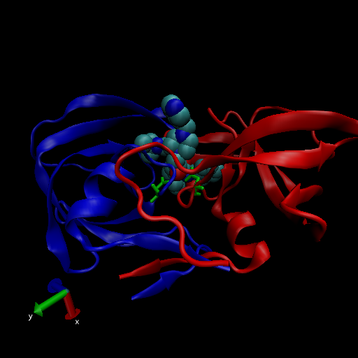
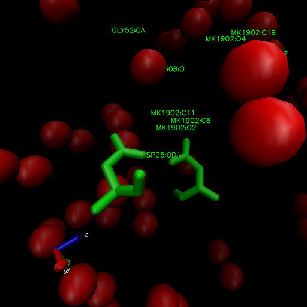

```{r}
data <- read.csv('Data Export Summary.csv', row.names = 1)
data
```

> Q1: What percentage of structures in the PDB are solved by X-Ray and Electron Microscopy.

```{r}
xray_percent <- 100 * sum(data$X.ray) / sum(data$Total)
xray_percent
```
```{r}
em_perc <- 100 * sum(data$EM) / sum(data$Total)
em_perc
```
for every column

```{r}
colSums(data) / sum(data$Total) * 100
```

> Q2: What proportion of structures in the PDB are protein?

```{r}
prot_perc <- 100 * sum(data$Total[1]) / sum(data$Total)
prot_perc
```

> Q3: Type HIV in the PDB website search box on the home page and determine how many HIV-1 protease structures are in the current PDB?

23409

> Q4: Water molecules normally have 3 atoms. Why do we see just one atom per water molecule in this structure?

The resolution is higher than the size of hydrogen




> Q5: There is a conserved water molecule in the binding site. Can you identify this water molecule? What residue number does this water molecule have (see note below)?

HOH 308


```{r}
library(bio3d)
pdb <- read.pdb('1hel')
pdb
```

```{r}
head(pdb$atom)
```

Do a normal mode analysis (NMA), a prediction of the conformational variability and intrinsic dynamics of this protein
```{r}
pdb <- read.pdb('1hel')
m <- nma(pdb)
plot(m)
```

Make a little movie (trajectory) for viewing in VMD. 
```{r}
mktrj(m, file = 'nma.pdb')
```

