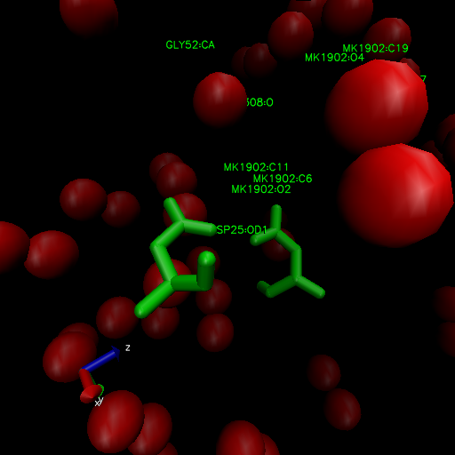

Class 11
================

``` r
data <- read.csv('Data Export Summary.csv', row.names = 1)
data
```

    ##                          X.ray   NMR   EM Multiple.methods Neutron Other  Total
    ## Protein (only)          142419 11807 6038              177      70    32 160543
    ## Protein/Oligosaccharide   8426    31  991                5       0     0   9453
    ## Protein/NA                7498   274 2000                3       0     0   9775
    ## Nucleic acid (only)       2368  1378   60                8       2     1   3817
    ## Other                      149    31    3                0       0     0    183
    ## Oligosaccharide (only)      11     6    0                1       0     4     22

> Q1: What percentage of structures in the PDB are solved by X-Ray and
> Electron Microscopy.

``` r
xray_percent <- 100 * sum(data$X.ray) / sum(data$Total)
xray_percent
```

    ## [1] 87.52836

``` r
em_perc <- 100 * sum(data$EM) / sum(data$Total)
em_perc
```

    ## [1] 4.94687

for every column

``` r
colSums(data) / sum(data$Total) * 100
```

    ##            X.ray              NMR               EM Multiple.methods 
    ##      87.52836071       7.35991033       4.94686958       0.10555353 
    ##          Neutron            Other            Total 
    ##       0.03917451       0.02013134     100.00000000

> Q2: What proportion of structures in the PDB are protein?

``` r
prot_perc <- 100 * sum(data$Total[1]) / sum(data$Total)
prot_perc
```

    ## [1] 87.3499

> Q3: Type HIV in the PDB website search box on the home page and
> determine how many HIV-1 protease structures are in the current PDB?

23409

> Q4: Water molecules normally have 3 atoms. Why do we see just one atom
> per water molecule in this structure?

The resolution is higher than the size of hydrogen


> Q5: There is a conserved water molecule in the binding site. Can you
> identify this water molecule? What residue number does this water
> molecule have (see note below)?

HOH 308



``` r
library(bio3d)
pdb <- read.pdb('1hel')
```

    ##   Note: Accessing on-line PDB file

``` r
pdb
```

    ## 
    ##  Call:  read.pdb(file = "1hel")
    ## 
    ##    Total Models#: 1
    ##      Total Atoms#: 1186,  XYZs#: 3558  Chains#: 1  (values: A)
    ## 
    ##      Protein Atoms#: 1001  (residues/Calpha atoms#: 129)
    ##      Nucleic acid Atoms#: 0  (residues/phosphate atoms#: 0)
    ## 
    ##      Non-protein/nucleic Atoms#: 185  (residues: 185)
    ##      Non-protein/nucleic resid values: [ HOH (185) ]
    ## 
    ##    Protein sequence:
    ##       KVFGRCELAAAMKRHGLDNYRGYSLGNWVCAAKFESNFNTQATNRNTDGSTDYGILQINS
    ##       RWWCNDGRTPGSRNLCNIPCSALLSSDITASVNCAKKIVSDGNGMNAWVAWRNRCKGTDV
    ##       QAWIRGCRL
    ## 
    ## + attr: atom, xyz, seqres, helix, sheet,
    ##         calpha, remark, call

``` r
head(pdb$atom)
```

    ##   type eleno elety  alt resid chain resno insert      x      y      z o     b
    ## 1 ATOM     1     N <NA>   LYS     A     1   <NA>  3.294 10.164 10.266 1 11.18
    ## 2 ATOM     2    CA <NA>   LYS     A     1   <NA>  2.388 10.533  9.168 1  9.68
    ## 3 ATOM     3     C <NA>   LYS     A     1   <NA>  2.438 12.049  8.889 1 14.00
    ## 4 ATOM     4     O <NA>   LYS     A     1   <NA>  2.406 12.898  9.815 1 14.00
    ## 5 ATOM     5    CB <NA>   LYS     A     1   <NA>  0.949 10.101  9.559 1 13.29
    ## 6 ATOM     6    CG <NA>   LYS     A     1   <NA> -0.050 10.621  8.573 1 13.52
    ##   segid elesy charge
    ## 1  <NA>     N   <NA>
    ## 2  <NA>     C   <NA>
    ## 3  <NA>     C   <NA>
    ## 4  <NA>     O   <NA>
    ## 5  <NA>     C   <NA>
    ## 6  <NA>     C   <NA>

Do a normal mode analysis (NMA), a prediction of the conformational
variability and intrinsic dynamics of this protein

``` r
pdb <- read.pdb('1hel')
```

    ##   Note: Accessing on-line PDB file

    ## Warning in get.pdb(file, path = tempdir(), verbose = FALSE): /var/folders/5b/
    ## nx310gbn5pd_zqfnjpsgkt200000gn/T//Rtmp7qHyIB/1hel.pdb exists. Skipping download

``` r
m <- nma(pdb)
```

    ##  Building Hessian...     Done in 0.029 seconds.
    ##  Diagonalizing Hessian...    Done in 0.144 seconds.

``` r
plot(m)
```

<!-- -->

Make a little movie (trajectory) for viewing in VMD.

``` r
mktrj(m, file = 'nma.pdb')
```
