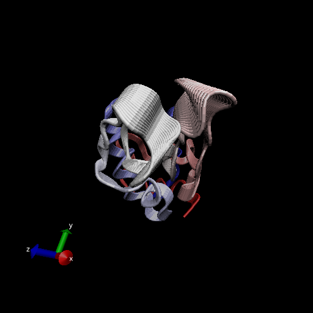
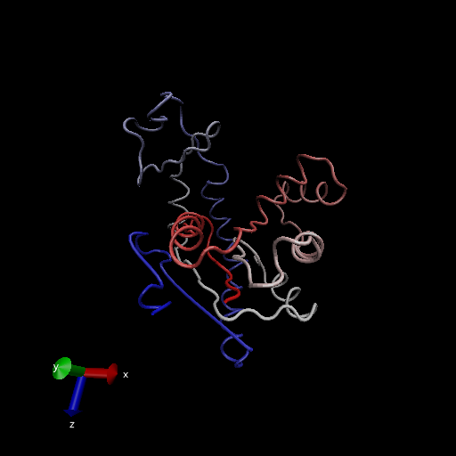
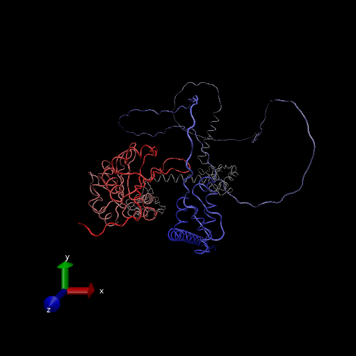

# Working with bio3d

```{r}
library(bio3d)
pdb <- read.pdb('1hel')
pdb
```
```{r}
head(pdb$atom)
```
Let's do a quick bioinformatics prediction of protein dynamics (flexibility). We use 'nma()' function, which does Normal Mode Analysis

```{r}
modes <- nma(pdb)
plot(modes)
```

Make a trajectory of this prediction with the 'mktrj()'

```{r}
mktrj(modes, file = "nma.pdb")
```




# Comparative Structure Analysis

Start by getting a sequence of interest

```{r}
aa <- get.seq("1AKE_A")
aa
```
Search  PDB database for sequences like aa sequence
```{r}
blast <- blast.pdb(aa)
```

```{r}
hits <- plot(blast)
hits
```
Have top hits from PDB search

```{r}
hits$pdb.id
```

Download these hits

```{r}
files <- get.pdb(hits$pdb.id, path='pdbs', split=TRUE, gzip=TRUE)
```
Align all these structures by using 'pdbaln()', 

```{r}
pdbs <- pdbaln(files, fit = TRUE)
```

```{r}
pdbs
```

```{r}
# Vector containing PDB codes for figure axis
ids <- basename.pdb(pdbs$id)

# Draw schematic alignment
plot(pdbs, labels=ids)
```

```{r}
pdbs$xyz
```
## Principal Component Analysis (PCA)

PCA on the xyz coordinate data of all 16 structures with bio3d 'pca()' function 
```{r}
pc <- pca(pdbs)
plot(pc)
```
Visualize displacements(i.e. movements of the structure) that are captured by PC1

```{r}
mktrj(pc, pc=1, file="pca.pdb")
```




Save important results
```{r}
save(blast, hits, pca, file="myresults.RData")
```


