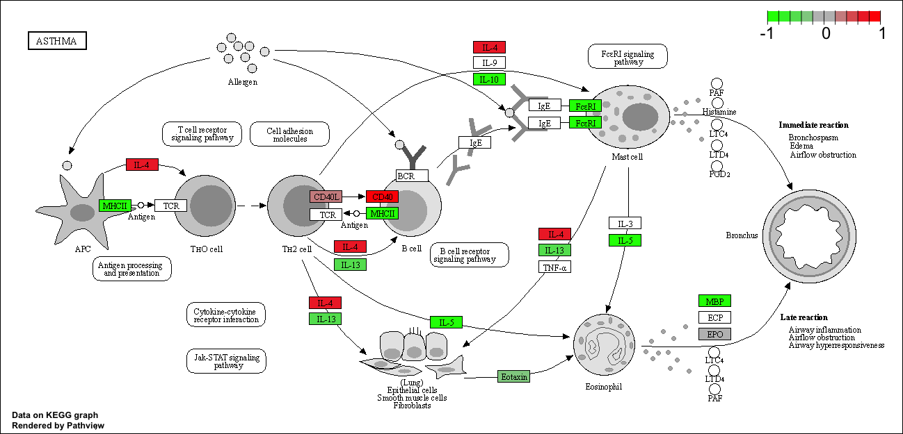

Background

RNA-seq analysis: dex effects on cells

Loading countData and colData (design of experiment)
```{r}
counts <- read.csv("airway_scaledcounts.csv", row.names=1)
metadata <-  read.csv("airway_metadata.csv")
```

```{r}
head(counts)
```

```{r}
head(metadata)
# info about each cell line's (column's) treatment
```

Check correspondence of metadata and countData

```{r}
all(metadata[,1] == colnames(counts))
```
all function checks if every element in array is TRUE

```{r}
all(c(T,T,T,T,F))
```
compare control to treated:

- first access control columns in our counts 
```{r}
control.inds <- metadata$dex == "control"
```

```{r}
control.ids <- metadata[control.inds,]$id
control.ids
```
```{r}
#alternative method to get indices of control samples
which(control.inds==TRUE)
```
```{r}
head(counts[,control.ids])
```
```{r}
control.mean <- rowMeans(counts[,control.ids])
head(control.mean)
```
same steps for treated
```{r}
treated.inds <- metadata$dex == "treated"
treated.ids <- metadata[treated.inds,]$id
treated.mean <- rowMeans(counts[,treated.ids])
head(treated.mean)

```
put means of both treated and control in one dataframe

```{r}
meancounts <- data.frame(control.mean, treated.mean)
head(meancounts)
```
There are `r nrow(counts)` rows/genes in this dataset
```{r}
nrow(counts)
```

Compare control and treated
```{r}
plot(meancounts)
```

need data transformation because many points are hidden in bottom left
```{r}
plot(meancounts, log="xy")
```
```{r}
log2(80/20)
```
log 2 fold change means a 4x change

add log2foldchange column to dataframe
```{r}
meancounts$log2fc <- log2(meancounts[,"treated.mean"]/meancounts[,"control.mean"])
head(meancounts)
```

need to get rid of NaN and -Inf values
the `which()` function gives indices where elements are TRUE
```{r}
inds <- which(meancounts[,1:2] == 0, arr.ind = TRUE)
head(inds)
```

```{r}
to.rm <- unique(sort(inds[,"row"]))
```

```{r}
mycounts <- meancounts[-to.rm,]
head(mycounts)
```
We now have `r nrow(mycounts)` genes remaining

number of upregulated genes (logfc > 2)

```{r}
sum(mycounts$log2fc > 2)
```
as a percentage
```{r}
100*sum(mycounts$log2fc > 2) / nrow(mycounts)
```

number of downregulated genes
```{r}
sum(mycounts$log2fc < -2)
```

as a percentage
```{r}
100*sum(mycounts$log2fc < -2) / nrow(mycounts)
```

DESeq2 analysis

```{r}
library(DESeq2)
```

first set up DESeq input object
```{r}
dds <- DESeqDataSetFromMatrix(countData=counts, 
                              colData=metadata, 
                              design=~dex)
dds
```

```{r}
dds <- DESeq(dds)
```

```{r}
res <- results(dds)
head(res)
```

Volcano plot

```{r}
plot(res$log2FoldChange, -log(res$padj))
abline(v=c(-2,2), col="gray")
abline(h=-log(0.05), col="gray")
```

```{r}
library("AnnotationDbi")
library("org.Hs.eg.db")
```

```{r}
columns(org.Hs.eg.db)

```

```{r}
res$symbol <- mapIds(org.Hs.eg.db,
                     keys=row.names(res), # Our genenames
                     keytype="ENSEMBL",        # The format of our genenames
                     column="SYMBOL",          # The new format we want to add
                     multiVals="first")

head(res$symbol)
```
```{r}
head(res)
```
save results to date

```{r}
write.csv(res, file='allmyresults.csv')
```

Pathway analysis: use Kegg

```{r message=FALSE}
library(pathview)
library(gage)
library(gageData)

data(kegg.sets.hs)

# Examine the first 2 pathways in this kegg set for humans
head(kegg.sets.hs, 2)
```

Before using Kegg, need to get gene identifiers into correct format: ENTREZ format

```{r}

```

```{r}
res$entrez <- mapIds(org.Hs.eg.db,
                     keys=row.names(res), # Our genenames
                     keytype="ENSEMBL",        # The format of our genenames
                     column="ENTREZID",          # The new format we want to add
                     multiVals="first")

res$genename <- mapIds(org.Hs.eg.db,
                     keys=row.names(res), # Our genenames
                     keytype="ENSEMBL",        # The format of our genenames
                     column="GENENAME",          # The new format we want to add
                     multiVals="first")
```
```{r}
foldchanges <- res$log2FoldChange
head(foldchanges)
```

```{r}
names(foldchanges) <- res$entrez
head(foldchanges)
```

pass into gage function
```{r}
keggres = gage(foldchanges, gsets=kegg.sets.hs)
```


can use attributes for any R object
```{r}
attributes(keggres)
```

```{r}
head(keggres$less, 3)
```
pathview function adds genes to a KEGG pathway as colored entries
```{r}
pathview(gene.data=foldchanges, pathway.id="hsa05310")
```



