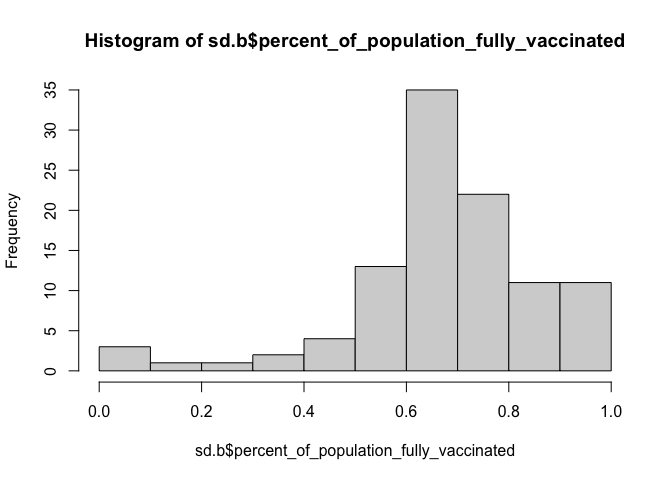
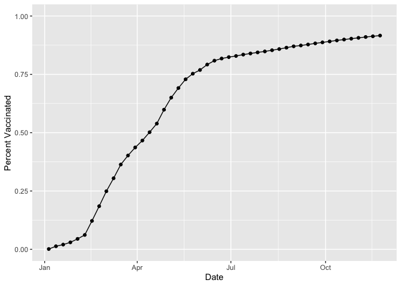
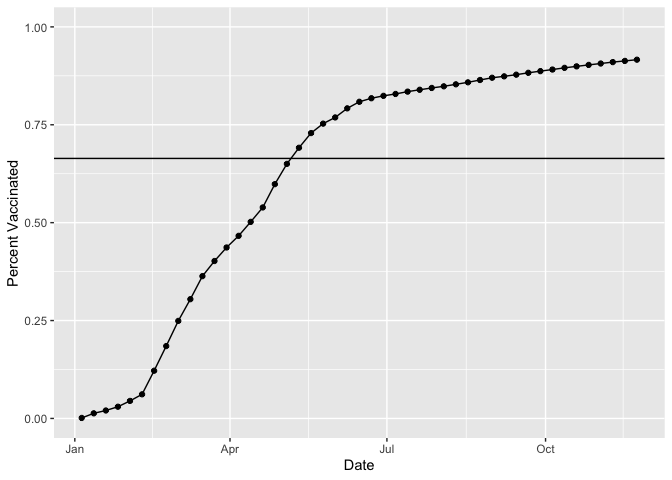
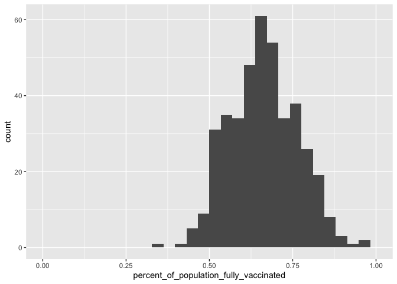
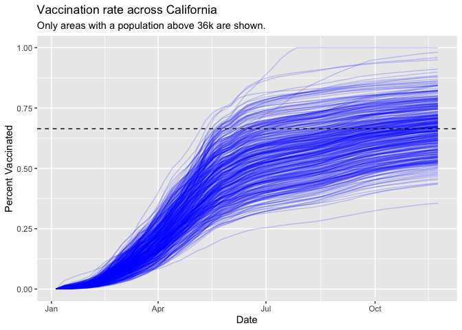

class 17 new
================
Shivani Khosla (PID: A59010433)
11/28/2021

``` r
# Import vaccination data
vax <- read.csv("covid19vaccinesbyzipcode_test.csv")
head(vax)
```

    ##   as_of_date zip_code_tabulation_area local_health_jurisdiction         county
    ## 1 2021-01-05                    92395            San Bernardino San Bernardino
    ## 2 2021-01-05                    93206                      Kern           Kern
    ## 3 2021-01-05                    91006               Los Angeles    Los Angeles
    ## 4 2021-01-05                    91901                 San Diego      San Diego
    ## 5 2021-01-05                    92230                 Riverside      Riverside
    ## 6 2021-01-05                    92662                    Orange         Orange
    ##   vaccine_equity_metric_quartile                 vem_source
    ## 1                              1 Healthy Places Index Score
    ## 2                              1 Healthy Places Index Score
    ## 3                              3 Healthy Places Index Score
    ## 4                              3 Healthy Places Index Score
    ## 5                              1 Healthy Places Index Score
    ## 6                              4 Healthy Places Index Score
    ##   age12_plus_population age5_plus_population persons_fully_vaccinated
    ## 1               35915.3                40888                       NA
    ## 2                1237.5                 1521                       NA
    ## 3               28742.7                31347                       19
    ## 4               15549.8                16905                       12
    ## 5                2320.2                 2526                       NA
    ## 6                2349.5                 2397                       NA
    ##   persons_partially_vaccinated percent_of_population_fully_vaccinated
    ## 1                           NA                                     NA
    ## 2                           NA                                     NA
    ## 3                          873                               0.000606
    ## 4                          271                               0.000710
    ## 5                           NA                                     NA
    ## 6                           NA                                     NA
    ##   percent_of_population_partially_vaccinated
    ## 1                                         NA
    ## 2                                         NA
    ## 3                                   0.027850
    ## 4                                   0.016031
    ## 5                                         NA
    ## 6                                         NA
    ##   percent_of_population_with_1_plus_dose
    ## 1                                     NA
    ## 2                                     NA
    ## 3                               0.028456
    ## 4                               0.016741
    ## 5                                     NA
    ## 6                                     NA
    ##                                                                redacted
    ## 1 Information redacted in accordance with CA state privacy requirements
    ## 2 Information redacted in accordance with CA state privacy requirements
    ## 3                                                                    No
    ## 4                                                                    No
    ## 5 Information redacted in accordance with CA state privacy requirements
    ## 6 Information redacted in accordance with CA state privacy requirements

> Q1. What column details the total number of people fully vaccinated?

persons\_fully\_vaccinated

> Q2. What column details the Zip code tabulation area?

zip\_code\_tabulation\_area

> Q3. What is the earliest date in this dataset?

2021-01-05

> Q4. What is the latest date in this dataset?

2021-11-23

for summary of dataset, use skim function

``` r
skimr::skim(vax)
```

|                                                  |       |
|:-------------------------------------------------|:------|
| Name                                             | vax   |
| Number of rows                                   | 82908 |
| Number of columns                                | 14    |
| \_\_\_\_\_\_\_\_\_\_\_\_\_\_\_\_\_\_\_\_\_\_\_   |       |
| Column type frequency:                           |       |
| character                                        | 5     |
| numeric                                          | 9     |
| \_\_\_\_\_\_\_\_\_\_\_\_\_\_\_\_\_\_\_\_\_\_\_\_ |       |
| Group variables                                  | None  |

Data summary

**Variable type: character**

| skim\_variable              | n\_missing | complete\_rate | min | max | empty | n\_unique | whitespace |
|:----------------------------|-----------:|---------------:|----:|----:|------:|----------:|-----------:|
| as\_of\_date                |          0 |              1 |  10 |  10 |     0 |        47 |          0 |
| local\_health\_jurisdiction |          0 |              1 |   0 |  15 |   235 |        62 |          0 |
| county                      |          0 |              1 |   0 |  15 |   235 |        59 |          0 |
| vem\_source                 |          0 |              1 |  15 |  26 |     0 |         3 |          0 |
| redacted                    |          0 |              1 |   2 |  69 |     0 |         2 |          0 |

**Variable type: numeric**

| skim\_variable                                 | n\_missing | complete\_rate |     mean |       sd |    p0 |      p25 |      p50 |      p75 |     p100 | hist  |
|:-----------------------------------------------|-----------:|---------------:|---------:|---------:|------:|---------:|---------:|---------:|---------:|:------|
| zip\_code\_tabulation\_area                    |          0 |           1.00 | 93665.11 |  1817.39 | 90001 | 92257.75 | 93658.50 | 95380.50 |  97635.0 | ▃▅▅▇▁ |
| vaccine\_equity\_metric\_quartile              |       4089 |           0.95 |     2.44 |     1.11 |     1 |     1.00 |     2.00 |     3.00 |      4.0 | ▇▇▁▇▇ |
| age12\_plus\_population                        |          0 |           1.00 | 18895.04 | 18993.94 |     0 |  1346.95 | 13685.10 | 31756.12 |  88556.7 | ▇▃▂▁▁ |
| age5\_plus\_population                         |          0 |           1.00 | 20875.24 | 21106.04 |     0 |  1460.50 | 15364.00 | 34877.00 | 101902.0 | ▇▃▂▁▁ |
| persons\_fully\_vaccinated                     |       8355 |           0.90 |  9585.35 | 11609.12 |    11 |   516.00 |  4210.00 | 16095.00 |  71219.0 | ▇▂▁▁▁ |
| persons\_partially\_vaccinated                 |       8355 |           0.90 |  1894.87 |  2105.55 |    11 |   198.00 |  1269.00 |  2880.00 |  20159.0 | ▇▁▁▁▁ |
| percent\_of\_population\_fully\_vaccinated     |       8355 |           0.90 |     0.43 |     0.27 |     0 |     0.20 |     0.44 |     0.63 |      1.0 | ▇▆▇▆▂ |
| percent\_of\_population\_partially\_vaccinated |       8355 |           0.90 |     0.10 |     0.10 |     0 |     0.06 |     0.07 |     0.11 |      1.0 | ▇▁▁▁▁ |
| percent\_of\_population\_with\_1\_plus\_dose   |       8355 |           0.90 |     0.51 |     0.26 |     0 |     0.31 |     0.53 |     0.71 |      1.0 | ▅▅▇▇▃ |

> Q5. How many numeric columns are in this dataset?

9 numeric columns

> Q6. Note that there are “missing values” in the dataset. How many NA
> values there in the persons\_fully\_vaccinated column?

``` r
sum(is.na(vax$persons_fully_vaccinated))
```

    ## [1] 8355

> Q7. What percent of persons\_fully\_vaccinated values are missing (to
> 2 significant figures)?

``` r
round(sum(is.na(vax$persons_fully_vaccinated)) / length(vax$persons_fully_vaccinated) * 100, 2)
```

    ## [1] 10.08

> Q8. \[Optional\]: Why might this data be missing?

As mentioned in the introduction to the assignment, zip codes referring
to military bases will not show vaccination data due to the way the
database was put together.

package for working with dates

``` r
library(lubridate)
```

    ## 
    ## Attaching package: 'lubridate'

    ## The following objects are masked from 'package:base':
    ## 
    ##     date, intersect, setdiff, union

``` r
today()
```

    ## [1] "2021-12-03"

``` r
# Specify that we are using the year-month-day format
vax$as_of_date <- ymd(vax$as_of_date)
```

``` r
today() - vax$as_of_date[1]
```

    ## Time difference of 332 days

timeframe of dataset (time between first and last date in this data)

``` r
vax$as_of_date[nrow(vax)] - vax$as_of_date[1]
```

    ## Time difference of 322 days

> Q9. How many days have passed since the last update of the dataset?

``` r
today() - vax$as_of_date[nrow(vax)]
```

    ## Time difference of 10 days

> Q10. How many unique dates are in the dataset (i.e. how many different
> dates are detailed)?

``` r
length(table(vax$as_of_date))
```

    ## [1] 47

helpful package to deal with zipcodes

``` r
library(zipcodeR)
```

centroid of the La Jolla zip code

``` r
geocode_zip('92037')
```

    ## # A tibble: 1 x 3
    ##   zipcode   lat   lng
    ##   <chr>   <dbl> <dbl>
    ## 1 92037    32.8 -117.

distance between two zip codes

``` r
zip_distance('92037','92109')
```

    ##   zipcode_a zipcode_b distance
    ## 1     92037     92109     2.33

census data for zip codes

``` r
reverse_zipcode(c('92037', "92109") )
```

    ## # A tibble: 2 x 24
    ##   zipcode zipcode_type major_city post_office_city common_city_list county state
    ##   <chr>   <chr>        <chr>      <chr>                      <blob> <chr>  <chr>
    ## 1 92037   Standard     La Jolla   La Jolla, CA           <raw 20 B> San D… CA   
    ## 2 92109   Standard     San Diego  San Diego, CA          <raw 21 B> San D… CA   
    ## # … with 17 more variables: lat <dbl>, lng <dbl>, timezone <chr>,
    ## #   radius_in_miles <dbl>, area_code_list <blob>, population <int>,
    ## #   population_density <dbl>, land_area_in_sqmi <dbl>,
    ## #   water_area_in_sqmi <dbl>, housing_units <int>,
    ## #   occupied_housing_units <int>, median_home_value <int>,
    ## #   median_household_income <int>, bounds_west <dbl>, bounds_east <dbl>,
    ## #   bounds_north <dbl>, bounds_south <dbl>

``` r
# Subset to San Diego county only areas
sd <- vax[ vax$county == "San Diego" , ]
```

same as above but with dplyr

``` r
library(dplyr)
```

    ## 
    ## Attaching package: 'dplyr'

    ## The following objects are masked from 'package:stats':
    ## 
    ##     filter, lag

    ## The following objects are masked from 'package:base':
    ## 
    ##     intersect, setdiff, setequal, union

``` r
sd <- filter(vax, county == "San Diego")

nrow(sd)
```

    ## [1] 5029

filtering for data in San Diego county and a population of over 10,000

``` r
sd.10 <- filter(vax, county == "San Diego" &
                age5_plus_population > 10000)
```

> Q11. How many distinct zip codes are listed for San Diego County?

``` r
length(table(sd.10$zip_code_tabulation_area))
```

    ## [1] 76

> Q12. What San Diego County Zip code area has the largest 12 +
> Population in this dataset?

``` r
sd.10[order(sd.10$age12_plus_population, decreasing = TRUE),][1,'zip_code_tabulation_area']
```

    ## [1] 92154

> Q13. What is the overall average “Percent of Population Fully
> Vaccinated” value for all San Diego “County” as of “2021-11-09”?

``` r
sd.a <- filter(vax, county == "San Diego")
sd.b <- filter(sd.a, as_of_date == "2021-11-09")
head(sd.b)
```

    ##   as_of_date zip_code_tabulation_area local_health_jurisdiction    county
    ## 1 2021-11-09                    92081                 San Diego San Diego
    ## 2 2021-11-09                    92058                 San Diego San Diego
    ## 3 2021-11-09                    91902                 San Diego San Diego
    ## 4 2021-11-09                    92140                 San Diego San Diego
    ## 5 2021-11-09                    92124                 San Diego San Diego
    ## 6 2021-11-09                    92135                 San Diego San Diego
    ##   vaccine_equity_metric_quartile                 vem_source
    ## 1                              2 Healthy Places Index Score
    ## 2                              1 Healthy Places Index Score
    ## 3                              4 Healthy Places Index Score
    ## 4                             NA            No VEM Assigned
    ## 5                              3 Healthy Places Index Score
    ## 6                             NA            No VEM Assigned
    ##   age12_plus_population age5_plus_population persons_fully_vaccinated
    ## 1               25558.0                27632                    17333
    ## 2               34956.0                39695                    13892
    ## 3               16620.7                18026                    13101
    ## 4                3747.7                 3737                       38
    ## 5               25422.4                29040                    16121
    ## 6                 635.0                  635                       NA
    ##   persons_partially_vaccinated percent_of_population_fully_vaccinated
    ## 1                         2219                               0.627280
    ## 2                         2410                               0.349969
    ## 3                         1997                               0.726784
    ## 4                           14                               0.010169
    ## 5                         2060                               0.555131
    ## 6                           NA                                     NA
    ##   percent_of_population_partially_vaccinated
    ## 1                                   0.080305
    ## 2                                   0.060713
    ## 3                                   0.110784
    ## 4                                   0.003746
    ## 5                                   0.070937
    ## 6                                         NA
    ##   percent_of_population_with_1_plus_dose
    ## 1                               0.707585
    ## 2                               0.410682
    ## 3                               0.837568
    ## 4                               0.013915
    ## 5                               0.626068
    ## 6                                     NA
    ##                                                                redacted
    ## 1                                                                    No
    ## 2                                                                    No
    ## 3                                                                    No
    ## 4                                                                    No
    ## 5                                                                    No
    ## 6 Information redacted in accordance with CA state privacy requirements

``` r
mean(sd.b$percent_of_population_fully_vaccinated, na.rm = TRUE)
```

    ## [1] 0.6734714

> Q14. Using either ggplot or base R graphics make a summary figure that
> shows the distribution of Percent of Population Fully Vaccinated
> values as of “2021-11-09”?

``` r
hist(sd.b$percent_of_population_fully_vaccinated)
```

<!-- -->

``` r
ucsd <- filter(sd, zip_code_tabulation_area=="92037")
ucsd[1,]$age5_plus_population
```

    ## [1] 36144

> Q15. Using ggplot make a graph of the vaccination rate time course for
> the 92037 ZIP code area:

``` r
library(ggplot2)

ggplot(ucsd) +
  aes(x=as_of_date,
      y=percent_of_population_fully_vaccinated) +
  geom_point() +
  geom_line(group=1) +
  ylim(c(0,1)) +
  labs(x="Date", y="Percent Vaccinated")
```

<!-- -->

``` r
# Subset to all CA areas with a population as large as 92037
vax.36 <- filter(vax, age5_plus_population > 36144 &
                as_of_date == "2021-11-16")

head(vax.36)
```

    ##   as_of_date zip_code_tabulation_area local_health_jurisdiction         county
    ## 1 2021-11-16                    92020                 San Diego      San Diego
    ## 2 2021-11-16                    92563                 Riverside      Riverside
    ## 3 2021-11-16                    92806                    Orange         Orange
    ## 4 2021-11-16                    93291                    Tulare         Tulare
    ## 5 2021-11-16                    92335            San Bernardino San Bernardino
    ## 6 2021-11-16                    92618                    Orange         Orange
    ##   vaccine_equity_metric_quartile                 vem_source
    ## 1                              2 Healthy Places Index Score
    ## 2                              3 Healthy Places Index Score
    ## 3                              2 Healthy Places Index Score
    ## 4                              1 Healthy Places Index Score
    ## 5                              1 Healthy Places Index Score
    ## 6                              4 Healthy Places Index Score
    ##   age12_plus_population age5_plus_population persons_fully_vaccinated
    ## 1               49284.5                54991                    35128
    ## 2               55897.8                63794                    36051
    ## 3               33050.9                36739                    24810
    ## 4               46879.7                54254                    27936
    ## 5               79670.3                91867                    49820
    ## 6               40348.0                44304                    39695
    ##   persons_partially_vaccinated percent_of_population_fully_vaccinated
    ## 1                         5161                               0.638795
    ## 2                         4224                               0.565116
    ## 3                         2355                               0.675304
    ## 4                         4012                               0.514911
    ## 5                         5970                               0.542306
    ## 6                         3936                               0.895969
    ##   percent_of_population_partially_vaccinated
    ## 1                                   0.093852
    ## 2                                   0.066213
    ## 3                                   0.064101
    ## 4                                   0.073948
    ## 5                                   0.064985
    ## 6                                   0.088841
    ##   percent_of_population_with_1_plus_dose redacted
    ## 1                               0.732647       No
    ## 2                               0.631329       No
    ## 3                               0.739405       No
    ## 4                               0.588859       No
    ## 5                               0.607291       No
    ## 6                               0.984810       No

> Q16. Calculate the mean “Percent of Population Fully Vaccinated” for
> ZIP code areas with a population as large as 92037 (La Jolla)
> as\_of\_date “2021-11-16”. Add this as a straight horizontal line to
> your plot from above with the geom\_hline() function?

``` r
mean(vax.36$percent_of_population_fully_vaccinated)
```

    ## [1] 0.6640413

``` r
ggplot(ucsd) +
  aes(x=as_of_date,
      y=percent_of_population_fully_vaccinated) +
  geom_point() +
  geom_line(group=1) +
  geom_hline(yintercept =  mean(vax.36$percent_of_population_fully_vaccinated)) +
  ylim(c(0,1)) +
  labs(x="Date", y="Percent Vaccinated")
```

<!-- -->

> Q17. What is the 6 number summary (Min, 1st Qu., Median, Mean, 3rd
> Qu., and Max) of the “Percent of Population Fully Vaccinated” values
> for ZIP code areas with a population as large as 92037 (La Jolla)
> as\_of\_date “2021-11-16”?

``` r
summary(vax.36$percent_of_population_fully_vaccinated)
```

    ##    Min. 1st Qu.  Median    Mean 3rd Qu.    Max. 
    ##  0.3529  0.5905  0.6662  0.6640  0.7298  1.0000

> Q18. Using ggplot generate a histogram of this data.

``` r
ggplot(vax.36) +
  aes(percent_of_population_fully_vaccinated) +
  geom_histogram()+
  xlim(0,1)
```

    ## `stat_bin()` using `bins = 30`. Pick better value with `binwidth`.

    ## Warning: Removed 2 rows containing missing values (geom_bar).

<!-- -->

> Q19. Is the 92109 and 92040 ZIP code areas above or below the average
> value you calculated for all these above?

``` r
zip92109 <- vax[vax$zip_code_tabulation_area==92109,]
zip92109[zip92109$as_of_date=='2021-11-23',"percent_of_population_fully_vaccinated"] > mean(vax.36$percent_of_population_fully_vaccinated)
```

    ## [1] TRUE

for 92109: above

``` r
zip92040 <- vax[vax$zip_code_tabulation_area==92040,]
zip92040[zip92040$as_of_date=='2021-11-23',"percent_of_population_fully_vaccinated"] > mean(vax.36$percent_of_population_fully_vaccinated)
```

    ## [1] FALSE

for 92040: below

> Q20. Finally make a time course plot of vaccination progress for all
> areas in the full dataset with a age5\_plus\_population &gt; 36144.

``` r
vax.36.all <- filter(vax, vax$age5_plus_population > 36144)


ggplot(vax.36.all) +
  aes(as_of_date,
      percent_of_population_fully_vaccinated, 
      group=zip_code_tabulation_area) +
  geom_line(alpha=0.2, color="blue") +
  ylim(c(0,1)) +
  labs(x="Date", y="Percent Vaccinated",
       title="Vaccination rate across California",
       subtitle="Only areas with a population above 36k are shown.") +
  geom_hline(yintercept = mean(vax.36$percent_of_population_fully_vaccinated), linetype = 'dashed')
```

    ## Warning: Removed 176 row(s) containing missing values (geom_path).

<!-- -->

> Q21. How do you feel about traveling for Thanksgiving and meeting for
> in-person class next Week?

I personally do not mind meeting for in-person class next week, but I do
understand if others feel uncomfortable doing so, especially considering
the new CoV-2 variant. Thus, I would be fine with either an in-person or
virtual class setting next week.
