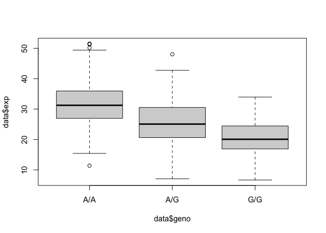

Class 19
================
Shivani Khosla (PID: A59010433)
12/2/2021

> Q13: Read this file into R and determine the sample size for each
> genotype and their corresponding median expression levels for each of
> these genotypes. Hint: The read.table(), summary() and boxplot()
> functions will likely be useful here. There is an example R script
> online to be used ONLY if you are struggling in vein. Note that you
> can find the medium value from saving the output of the boxplot()
> function to an R object and examining this object. There is also the
> medium() and summary() function that you can use to check your
> understanding.

reading in file with expression data

``` r
data <- read.table("rs8067378_ENSG00000172057.6.txt")
```

quantities of each genotype

``` r
table(data$geno)
```

    ## 
    ## A/A A/G G/G 
    ## 108 233 121

statistics for A/A genotype: median is 31.25

``` r
summary(data[data$geno=="A/A",])
```

    ##     sample              geno                exp       
    ##  Length:108         Length:108         Min.   :11.40  
    ##  Class :character   Class :character   1st Qu.:27.02  
    ##  Mode  :character   Mode  :character   Median :31.25  
    ##                                        Mean   :31.82  
    ##                                        3rd Qu.:35.92  
    ##                                        Max.   :51.52

statistics for A/G genotype: median is 25.065

``` r
summary(data[data$geno=="A/G",])
```

    ##     sample              geno                exp        
    ##  Length:233         Length:233         Min.   : 7.075  
    ##  Class :character   Class :character   1st Qu.:20.626  
    ##  Mode  :character   Mode  :character   Median :25.065  
    ##                                        Mean   :25.397  
    ##                                        3rd Qu.:30.552  
    ##                                        Max.   :48.034

statistics for G/G genotype: median is 20.074

``` r
summary(data[data$geno=="G/G",])
```

    ##     sample              geno                exp        
    ##  Length:121         Length:121         Min.   : 6.675  
    ##  Class :character   Class :character   1st Qu.:16.903  
    ##  Mode  :character   Mode  :character   Median :20.074  
    ##                                        Mean   :20.594  
    ##                                        3rd Qu.:24.457  
    ##                                        Max.   :33.956

> Q14: Generate a boxplot with a box per genotype, what could you infer
> from the relative expression value between A/A and G/G displayed in
> this plot? Does the SNP effect the expression of ORMDL3? Hint: An
> example boxplot is provided overleaf – yours does not need to be as
> polished as this one.

generate boxplot in base R; by using tilde, expression values are
grouped by genotype

``` r
boxplot(data$exp ~ data$geno)
```

<!-- -->

I answered the next part of the question in the lab sheet; I will
include the answer here as well: The median expression for A/A is higher
than for G/G, but there is lots of overlap in their distributions, so
the difference may not be statistically significant. I would say that
SNP does not affect ORMDL3 expression.
